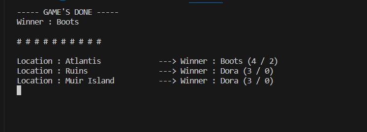
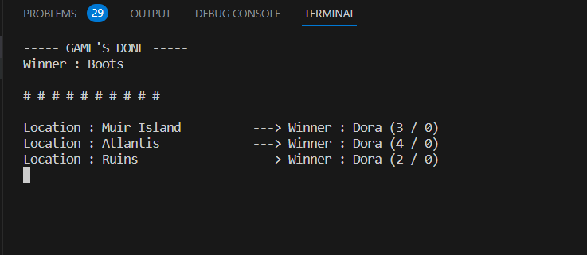

# MarvelSnap Development Log

## TODO
- [ ] Modify AddPlayer method in GR so that it can accept only 2 players (Assigned : 230731. Done : _ )
- [ ] Modify SetLocations method in GR so that it can accept only 3 locations. When the _locationInfo.Count has reached 3, returns false. (Assigned : 230731. Done : _ )
- [ ] Construct algorithm to limit the amount of cards in LocationConfig. only 4 (Assigned : 230731. Done : _ )
- [x] Modify GoNextRound method to add 1 energy to players after each round (Assigned : 230731. Done : 230801 )
- [x] Add ComputeScore method in LocationConfig to compute score in a location. Set to private, and called everytime GetPlayersScore is invoked (Assigned : 230731. Done : 230801 ) --> check!
- [x] Add GetWinner method in LocationConfig (Assigned : 230731. Done : 230801 )
- [x] Add GetLocationWinner method in GR and its overload using Location param (Assigned : 230731. Done : 230801 )
- [ ] Modify GetLocationScore (Assigned : 230801. Done : _ )
- [x] Construct Display-Locations relations between GR and Program in GamePlay_Testing() (Assigned : 230801. Done : 230802 )
- [x] Construct Reveal Cards (Assigned : 230801. Done : 230802 )
- [ ] Construct Execute Cards, Execute Locations in GR (Assigned : 230801. Done : _ )
- [x] **!!!! EVALUATE PLAYER'S ENERGY WHEN CHOOSING CARD !!!!** (Assigned : 230802. Done : 230803 )
- [x] **!!! NARUH LEBIH DARI SATU KARTU !!!** (Assigned : 230803. Done : _ )
- [ ] Every loc, every player, max 4 cards (Assigned : 230802. Done : _ )
- [x] **!!!! ILANGIN CARD YANG UDAH DIPAKE DARI DECK !!!!** (Assigned : 230802. Done : _ )
- [ ] **! TIMER !** --> *Development* (Assigned : 230803. Done : _ )
- [ ] Modify Display-Locations algoritm in Program to display "2" and "3" in 2nd and 3rd locations in the 1st and 2nd round (Assigned : 230802. Done : _ )

## BUGS
- [ ] Winnernya Boots teros --> Di determine winner (Assigned : 230803. Done : _ )
 
 
 
- [ ] Exception Handler:
  - [x] Handle exception when player insert invalid character when choosing card index and location index (Assigned : 230802. Done : _ )
  - [x] (User Input) Null input (Assigned : 230804. Done : _ )
  - [x] (User Input) Not numeric input (Assigned : 230804. Done : _ )
  - [ ] Kalo location null, method determine winner bakal exception: Unhandled exception. System.NullReferenceException: Object reference not set to an instance of an object. (Assigned : 230804. Done : _ )

## MarvelSnap-DAY! (23-08-05)
1. Major
   - [x] onreveal card skill
   - [ ] ongoing card skill
   - [ ] location skill
2. Minor
   - [ ] display location 1 and 2 in the early round
   - [ ] pas player nempatin kartu di board, ga langsung munculin skor tapi nunggu semua player masukin kartu ke board. jadi di akhir round baru nampilin skor
   - [ ] bug di winner, salah nentuin winner
   - [ ] bug di winner, kalo ada loc yg kosong malah exception